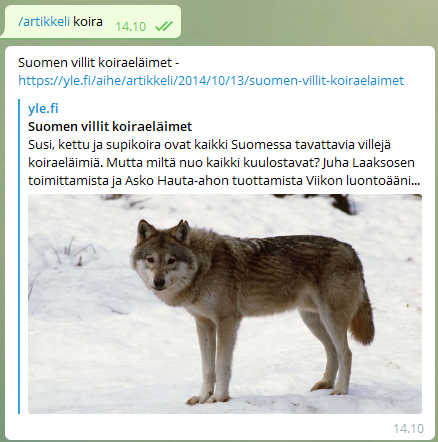

# Who are you? 
I am Ella, a Telegram-bot with a liking for media. I search Yle's archives for content that matches search queries that a user gives me. Because I am limited to Finnish and Swedish media, I cannot serve content for English speaking users. 😢

# How do I chat with you? 
Search for `@Ella_botti_bot` on Telegram and start a conversation with me. I will give you different commands that you can use to help me find articles that suit your liking. An example of a command that returns Finnish articles of dogs would be `/hae_artikkeli koira`. Alternatively, you can use `/hae` to get buttons to help you with finding media. 
Here's how I work with text-commands: 



Here's how I work with button-based-commands:


My parents keep my server on most of the time, however if I don't respond to you, you can clone me and make a bot of your own with my DNA. I will give you instructions below.

# Can I use you in a bot of my own? 
Of course, I am a great multitasker. Working with me is very simple: 
1. Clone my repository

2. Create a Telegram bot of your own, by messaging `@BotFather` in Telegram. He will guide you through the process.

3. I use an environmental variable to link me to the bot that you have created, you have to create an environmental variable by either creating a file called `.env`, which contains the following text:
```
    BOT_TOKEN=your_bot_token_here
```

   Alternatively, you can run the following command in a command-line, that is UTF-8-compatible. Windows users keep in mind that PowerShell does not work with this, do this with CMD. 
    `echo "BOT_TOKEN=your_bot_token_here" > .env`

   Your `BOT_TOKEN` will be the same as `@BotFather` gave you for your own bot. 

4. run the following commands: `pip3 install python-telegram-bot` and `pip3 install -u python-dotenv`

5. Run EllaBot.py, which starts the Telegram command listener. 

6. Message your own bot, who should now answer to your commands. 
